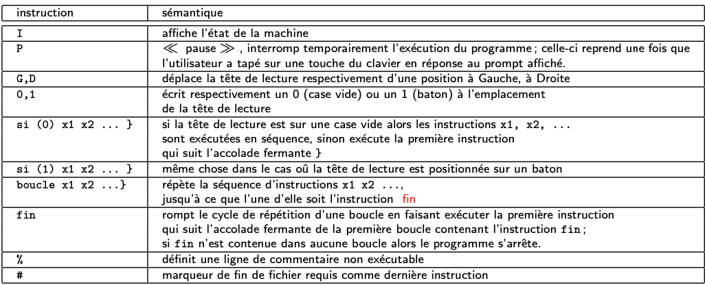

# Projet Calculabilités

- Le projet consiste à créer un générateur automatique de préconditions et postconditions pour un programme écrit dans un format spécifique appelé MTddV (Machine de Turing de M. del Vigna). L’objectif est de diviser ce processus en plusieurs modules, avec une équipe se concentrant sur le Module 1

## Objectif du projet
- **Analyse syntaxique:** le Module 1 doit analyser un programme écrit en MTddV, en vérifiant sa syntaxe. Cela inclut la détection des différentes instructions (comme "si", "boucle", "fin", "instruction"), ainsi que leur organisation logique.

- **Transformation en structure arborescente:** une fois le programme analysé, le module doit convertir ce code en une structure de données arborescente(Nous avons choisi en JSON). Cette structure facilite la compréhension de la hiérarchie et des relations entre les différentes parties du programme. Par exemple, les instructions dans une boucle ou une condition seront représentées comme des enfants dans cette arborescence.Cette structure arborescente sera ensuite transmise au Module 2, qui générera les assertions nécessaires (préconditions et postconditions).

## Méthodologie
L'arbre doit représenter :
- Les instructions fondamentales : telles que I, P, G, D, 0, et 1.
- Les structures de contrôle : notamment les conditions (si) et les boucles (boucle).

### Librairies utilisées
- Plusieurs bibliothèques standard de Python sont utilisées:
- `re`: Permet de matcher des modèles spécifiques dans les lignes de code.
Dans la fonction parse_line, des expressions régulières sont utilisées pour identifier :
1. Les instructions conditionnelles (si(...)).
2. Les mots-clés comme boucle, fin, pause, etc.
3. Les instructions simples (I, D, G, 0, 1).
- `json`: Conversion de la structure arborescente en un format JSON pour stockage ou transfert -> À la fin du script, le résultat est exporté en un fichier JSON via cette bibliothèque
### Parsing
- Dans `analyseur.py`, chaque ligne du programme est analysée pour identifier des mots-clés comme si(condition), boucle, ou des instructions simples comme I, D, ou G.

### Gestion des blocs imbriqués
- Une pile est utilisée pour gérer les structures imbriquées (comme les boucles / les conditions). Cela permet d’assurer que chaque bloc ouvert (par exemple, une boucle) est bien associé à ses instructions internes jusqu’à sa fermeture.

### Production de JSON
- Une fois analysé, le programme est transformé en un format JSON (exemple disponible dans le fichier `resultat.json`).

## Fonctions Utilisées
1. `read_file_lines(filename)`
Lit un fichier ligne par ligne en essayant plusieurs encodages (utf-8, latin-1, etc.), et retourne une liste des lignes du fichier.

2. `parse_line(line)`
Analyse une ligne de texte pour identifier les instructions, conditions (si), et structures comme les boucles (boucle), en utilisant des expressions régulières, et retourne une liste des tokens correspondants.

3. `parse_instructions(lines)`
Construit une structure arborescente représentant le programme à partir des lignes analysées, en gérant les blocs imbriqués (si, boucle) et les instructions simples.

4. `read_turing_file(filename)`
Lit un fichier de programme MTddV, en analyse les instructions ligne par ligne, génère une structure arborescente complète et la retourne sous forme de dictionnaire.

5. Bloc principal `(if __name__ == "__main__":)`
l'exécution du script via la ligne de commande, prenant un fichier d'entrée et un fichier de sortie comme arguments, et écrit la structure analysée dans un fichier JSON.